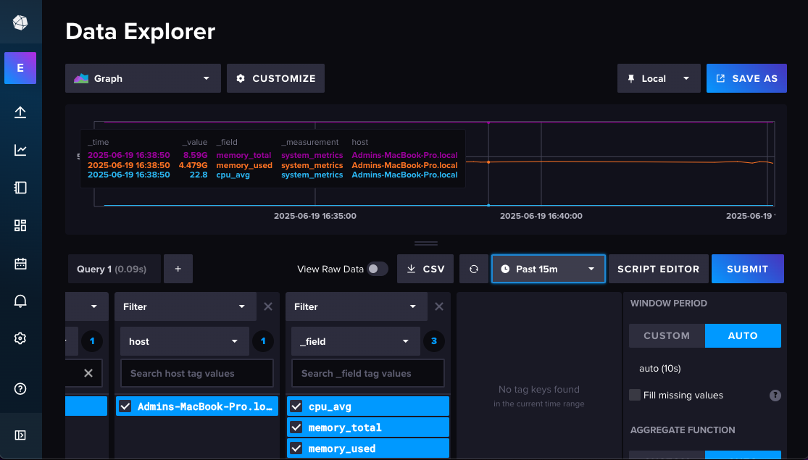
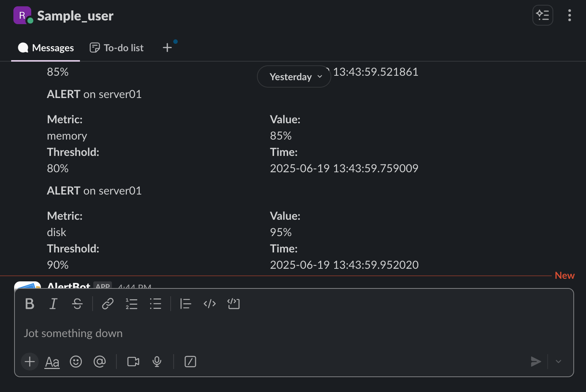
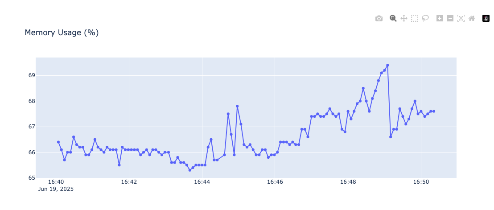
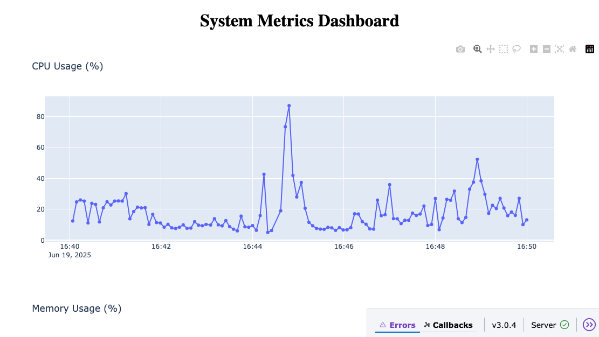

# Linux Resource Monitoring Service — Summary Report

## Overview

This project provides a lightweight Linux system resource monitoring solution that collects, ingests, stores, and visualizes key system metrics in near real-time. It showcases core Site Reliability Engineering (SRE) principles, including metrics collection, REST API design, authentication, data storage, and frontend visualization.

---

## Components

### 1. Metrics Collector (`monitoring/collector/metrics.py`)

* Utilizes the `psutil` library to gather detailed system metrics:

  * CPU usage (per core and overall average)
  * Memory usage (total, used, free, percentage)
  * Disk usage (total, used, free, percentage)
* Captures metrics alongside timestamps and the system’s hostname for context.

### 2. Ingestion Server (`monitoring/ingestion/server.py`)

* Built on FastAPI, exposing REST endpoints:

  * `POST /ingest`: Accepts metrics payloads, secured via Bearer token authentication.
  * `GET /history`: Provides recent metrics stored in an in-memory deque (up to 1000 records).
* Implements request validation and error handling to ensure data integrity.
* Logs important events such as validation errors and unauthorized access attempts.

### 3. Monitoring Script (`monitoring/monitor.py`)

* Runs as a daemon or scheduled process.
* Periodically collects system metrics using the collector module.
* Sends JSON metrics data securely to the ingestion server’s `/ingest` endpoint.
* Includes structured logging and retry logic for reliability.

### 4. InfluxDB Integration (`monitoring/influx_client.py`)

* Integration to persist metrics in InfluxDB, a time-series database.
* Uses InfluxDB's Python client to write CPU, memory, and disk metrics.
* Makes it possible to query historical data for extended periods.
* The connection configuration is handled via config.yaml.




### 5. Alerting (`monitoring/collector/alerts.py`)

* Reads thresholds and cooldown periods from config.yaml.
* Supports alerting via: Slack(Webhook) and Email(SMTB-Baesd).
* Prevents alert storms with a cooldown mechanism.



### 6. Dashboard (`monitoring/dashboard.py`)

* Developed with Plotly Dash to provide an interactive web-based interface.
* Polls the ingestion server’s `/history` endpoint every 5 seconds for updated data.
* Visualizes CPU, memory, and disk usage with dynamic time-series graphs.
* Runs locally and is accessible via `http://localhost:8050`.





---

## Key Features

* Near real-time system resource monitoring with automatic updates.
* Secure and token-authenticated ingestion endpoint.
* Efficient in-memory storage for recent metrics with configurable size.
* Robust error handling and structured logging.
* Modular architecture separating collection, ingestion, and visualization concerns.
* Easily extendable for additional metrics, alerting, or persistent storage.

---

## How to Run

1. **Start the Ingestion Server:**

   ```bash
   uvicorn monitoring.ingestion.server:app --host 0.0.0.0 --port 8000
   ```

2. **Run the Monitoring Script:**

   ```bash
   python monitoring/monitor.py
   ```

3. **Launch the Dashboard:**

   ```bash
   python monitoring/dashboard.py
   ```

4. **Access the Dashboard:**

   Open [http://localhost:8050](http://localhost:8050) in your browser.

---

## Deployment

### Running as a Service with systemd (Linux)

To ensure the monitoring script and ingestion server run continuously and restart on failure, configure them as systemd services:

1. Place your service files (`monitor.service`, `ingestion.service`, `dashboard.service`) in `/etc/systemd/system/`.

2. Reload systemd daemon:

   ```bash
   sudo systemctl daemon-reload
   ```

3. Enable and start services:

   ```bash
   sudo systemctl enable monitor.service ingestion.service dashboard.service
   sudo systemctl start monitor.service ingestion.service dashboard.service
   ```

4. Check service status and logs:

   ```bash
   sudo systemctl status monitor.service
   journalctl -u monitor.service -f
   ```

> **Note:** Update paths and environment variables in the service files to match your deployment environment.

### Running on AWS/Linux

* Clone the repository on your server.
* Set up Python virtual environment and install requirements.
* Configure environment variables (e.g., Slack webhook URL, SMTP credentials) using `.env`.
* Use systemd or process managers like `supervisord` or `pm2` for process management.
* Ensure firewall rules allow ports 8000 (ingestion API) and 8050 (dashboard) as needed.

---

## Alerting Setup

### Configuration

Alerts are configured via the `config/config.yaml` file:

* **Thresholds:** Set CPU, memory, and disk usage percent values to trigger alerts.
* **Cooldown:** Time window (in seconds) to prevent alert storms by suppressing duplicate alerts.
* **Slack:** Enable and provide a Slack webhook URL via environment variable `slack_webhook_url`.
* **Email:** Enable SMTP email alerts by configuring SMTP server, port, sender, recipient, and password (set as environment variable).

### Alert Mechanisms

* **Email Alerts:** Uses SMTP to send email notifications when thresholds are exceeded.
* **Slack Alerts:** Posts formatted messages to a configured Slack channel.
* **Logging:** Alerts are also logged with detailed JSON-formatted context.

### Avoiding Alert Storms

* The alerting module maintains timestamp tracking of last alerts per metric.
* Alerts for the same metric are suppressed within the cooldown window to avoid flooding.

---

## Testing

### Unit Tests

* Basic unit tests are provided to verify metric collection correctness.
* Tests use `pytest` and can be found in the `tests/` directory.

### Running Tests

Activate your virtual environment and run:

```bash
pytest
```

### What Is Tested?

* Validation that CPU, memory, and disk metrics are correctly collected and returned as expected data types.

